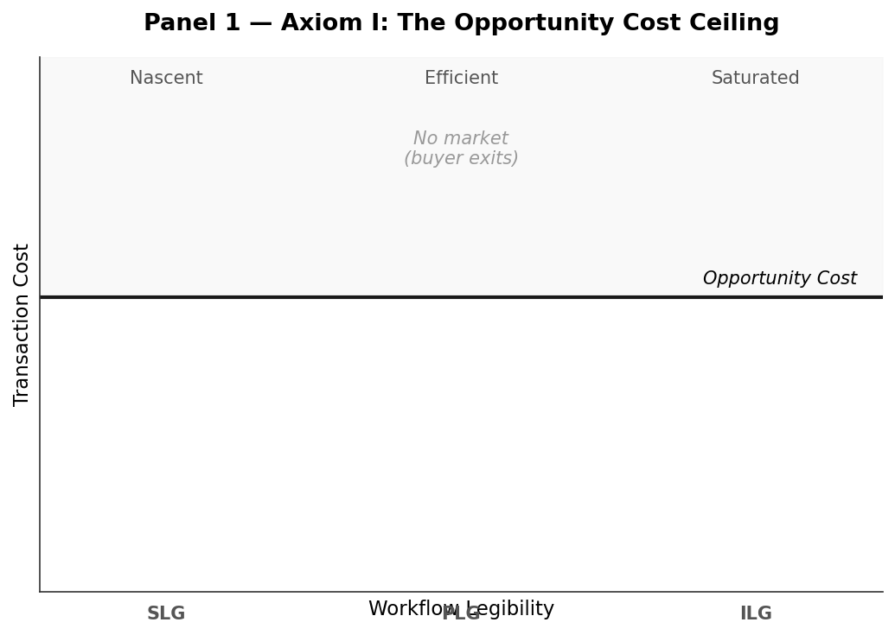
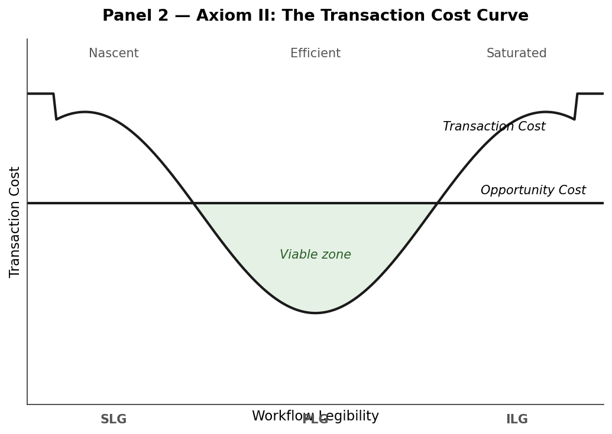
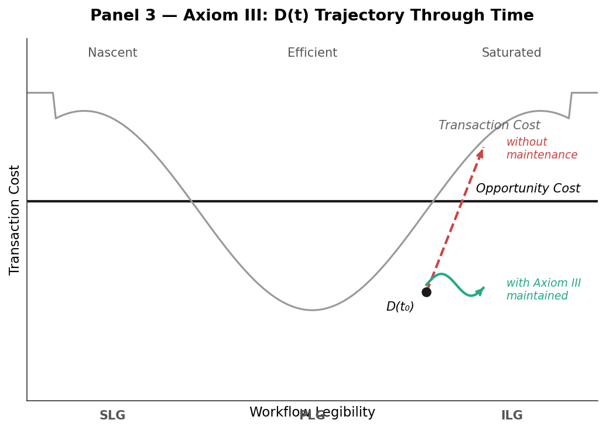

# The Constitution of Implementation-Led Growth (ILG)

**Version:** 16.0
**Purpose:** To define the economic and behavioral laws governing high-friction B2B sales, organized as a deductive framework: three axioms from which all concepts, equations, and prescriptions derive.

Version history is at the end of this document.

---

## Part I: The Three Axioms

The three axioms govern three aspects of any B2B transaction.

| Axiom | Governs | State | Tagline | Plain English |
|---|---|---|---|---|
| **I. Law of Transaction Cost Composition** | Whether a deal can happen | **Market** | *"Costs determine the deal"* | Buying costs more than money. |
| **II. Law of Uncertainty Inflation** | What the deal costs when it happens | **Deal** (T0) | *"Fear > Value"* | Uncertainty makes change expensive. |
| **III. Law of Governance** | Whether the deal persists | **Relationship** (T1+) | *"Structure determines behavior"* | Sales is governance design. |

### The three states

The State column is the framework's primary index. A practitioner arrives holding a situation rather than an axiom, and the situation names the state:

| State | The question it answers | Where the answer lives |
|---|---|---|
| **Market** | Which motion is viable here at all? | [Process Calculator](../../practice/01-field-assets/process-calculator.md), [01-sales-motion-comparison.md](./01-sales-motion-comparison.md) |
| **Deal** (T0) | What must be true, and what must the seller supply, before signature? | [Contextual Blueprint](../../practice/01-field-assets/ilg-motion/01-discovery-contextual-blueprint.md) → [Red Team](../../practice/01-field-assets/ilg-motion/02-validation-red-team-protocol.md) → [MIP](../../practice/01-field-assets/ilg-motion/03-closing-mutual-implementation-plan.md) |
| **Relationship** (T1+) | Does the surplus survive, and can a competitor take it? | [Sustaining Adoption Review](../../practice/01-field-assets/ilg-motion/04-sustaining-adoption-review.md), [05-seller-surplus-model.md §7](./05-seller-surplus-model.md) |

**Each axiom has a home state, and none is confined to it.** Axiom II runs past signature, where $\Delta_A(t) = \Delta_A(0) + \gamma t$ governs how fast an incumbent's advantage erodes. Axiom III runs at T0, because the MIP is signed at close. Axiom I recurs whenever a category commoditizes and the motion must be re-scored. Treat the mapping as where each axiom does most of its work, not as a partition.

Together they describe the *existence, economics, and dynamics* of any transaction in a high-friction market. Each axiom generates its own mathematical content. The equations integrate into the Surplus equation in Part III.

The three axioms are progressively visualized through a potential-well diagram that develops one panel at a time:

**Panel 1 — Axiom I.** A chart with one horizontal line: the Opportunity Cost ceiling. Above the line: no market.

**Panel 2 — Axiom II.** Add the U-shaped Transaction Cost curve. The well between the curve and the ceiling is where deals can close.

**Panel 3 — Axiom III.** Add a deal's trajectory $D(t) = TC(t) - OC(t)$ through time. Without active maintenance, $D(t)$ drifts upward toward the ceiling. With Axiom III sustained, the trajectory stays bounded below it.

---

### Axiom I — The Law of Transaction Cost Composition

> **Transaction costs in B2B deals decompose into three components: search, consensus, and implementation. Their composition selects the motion. Their combined level sets the boundary between Turnkey and Structural deals. Asset specificity drives that level, and the exposure it creates belongs to whichever party sinks the specific investment.**

> *Tagline: **"Costs determine the deal."** Which cost dominates decides how you sell. How much cost there is decides whether the deal is Turnkey or Structural.*
>
> *Plain English: Buying costs more than money. Finding it, agreeing on it, and installing it are three separate bills. The largest bill tells you how to sell. The total tells you how much apparatus the deal can carry. And whoever pays for work that fits only this one deal is the one left holding it if the deal dies.*
>
> *Origin: Coase (1937). Using the price mechanism is itself costly.*

**Mechanism (Williamson).** Coase established that firms exist to minimize transaction costs. Williamson operationalized this through *asset specificity*, the degree to which an investment is locked to a particular relationship. When asset specificity is high, the price mechanism alone is insufficient: the dependent party faces hold-up risk because once the asset-specific investment is sunk, the counterparty can extract its full value. To make "buy" preferable to "make," the buyer requires governance structures (the ILG artifacts) that reduce hold-up risk. When specificity is low, those same governance structures destroy surplus through over-engineering — a Turnkey deal does not need a Blueprint.

**Who bears the specificity (Klein, Crawford and Alchian).** Exposure follows the investment rather than the invoice. Whoever sinks capital that cannot be redeployed is the exposed party, whichever side of the transaction they sit on. Williamson's account is usually read from the buyer's side because the buyer is usually the one making the specific investment. That reading fails for a forward-deployed motion, where the seller commits engineering into the buyer's environment before signature and therefore holds the exposure first. The measure of what is at stake is the appropriable quasi-rent, not the hours worked, and the seller-side model is [05-seller-surplus-model.md](./05-seller-surplus-model.md). Research is in [klein-crawford-alchian.md](../02-research/klein-crawford-alchian.md).

**The three components are not statistically independent.** They arise from distinct conditions and respond to distinct interventions, which is what makes the decomposition diagnostically useful. They still move together. A workflow the product must fit but does not raises $F_{implementation}$ and generates $F_{consensus}$ at the same time, because an imposition creates a stakeholder whose objectives worsen. Treat the three as separately addressable, not as separately caused.

**Mathematical content.** The boundary condition for ILG applicability:

$$k > k_{threshold} \quad \text{and} \quad F_{deployed} \sim k$$

Where $k$ is the asset specificity of the deal and $F_{deployed}$ is the friction structure used to manage it. The first condition is necessary (Turnkey vs. Structural deal classification). The second is the scaling requirement (friction must match specificity).

**The two claims have different uses, and the boundary condition covers only one of them.** Level answers how much apparatus a deal can carry, and $k > k_{threshold}$ is that test. Composition answers which motion to run, and no equation here settles it: a deal whose cost sits almost entirely in $F_{search}$ takes a different motion from one of identical total sitting in $F_{implementation}$. The composition rule is operationalized rather than formalized, in [Process Calculator](../../practice/01-field-assets/process-calculator.md) Step 1 (market stage) and Step 2b (workflow divergence and the trialability gates). Do not read the summed score as a motion selector.

The boundary also has time dynamics. Value erodes from the triggering event:

$$V_{effective}(t) = V_{solution} \cdot e^{-\delta t}$$

As $V$ decays, the buyer's relative preference shifts back toward $V_{next\_best}$, including the "make" alternative. This is one component of the Decay Clock. The other component lives under Axiom II as $\Delta_A(t)$ dynamics.

**Failure modes.**

- **Under-frictioned (Velocity motion on a Structural deal).** Asset specificity too high for the friction deployed. The buyer faces hold-up risk and chooses to build internally rather than transact. Manifests as "we decided to handle this in-house" (Stanford ChatEHR, Apple's vertical silicon, any "we built it ourselves" story).
- **Over-frictioned (ILG on a Turnkey deal).** Asset specificity too low for the friction deployed. The cost of Blueprints, Red Teams, and MIPs exceeds the surplus they unlock. The buyer experiences over-engineering and chooses a competitor with lighter motion.
- **Mis-composed (right level, wrong motion).** Total friction read correctly, dominant component read wrongly, so the motion attacks a cost that is not binding. Education aimed at a buyer who already knows the category, or implementation proof supplied to a buyer who cannot yet name the problem. The score justifies the effort and the effort lands nowhere.

**Operating instruction.** Before deploying any sales motion, classify the deal against this boundary. The operational tool is the [Process Calculator](../../practice/01-field-assets/process-calculator.md).

---

### Axiom II — The Law of Uncertainty Inflation

> **Effective transaction cost equals base friction (search + consensus + implementation) amplified by the bilateral information asymmetry between buyer and seller. The amplifier shrinks when the claimant invests in demonstrations that low-quality competitors cannot affordably replicate. The Single Crossing Property is the test for what counts.**

> *Tagline: **"Fear > Value."** Reducing risk is ~2× more powerful than increasing ROI. The Safe No (declining to change, which risks nothing for the decider) beats the Logical Yes (accepting a positive business case).*
>
> *Plain English: Uncertainty makes change expensive. What a buyer cannot verify, they price as risk, and that multiplies every other cost rather than reducing the value.*
>
> *Origin: Spence (1973). A signal separates quality only when it costs something to send.*

**Mechanism (Coase + Spence + Kahneman/Tversky).** Coase identified three transaction costs (search, bargaining, and enforcement) that determine when markets fail. We operationalize these for B2B SaaS as $F_{search}$ (finding the category and a viable vendor), $F_{consensus}$ (internal alignment plus external bargaining), and $F_{implementation}$ (deployment plus sustained change). Spence's signaling theory provides the mechanism for reducing them: a signal separates quality from noise only when its cost is proportionally lower for the high-quality actor (the Single Crossing Property). Loss aversion ($\lambda \approx 2.25$ as conceptual anchor, likely higher in organizational contexts) explains why asymmetry multiplies friction rather than reducing value. Uncertainty inflates the perceived downside.

*Intuitively:* buyer uncertainty acts as noise in the channel between seller and buyer. Base friction is the signal; asymmetry is the noise multiplier. Demonstrations that low-quality competitors cannot replicate reduce the noise without touching the underlying signal cost.

**Mathematical content.** The effective transaction cost equation:

$$F_{effective} = (F_{search} + F_{consensus} + F_{implementation}) \cdot (1 + \Delta_A)$$

The bracketed sum is written $F_{base}$ where the components do not need to be named individually. It is the three costs before amplification.

To model transaction cost economics more directly at the deal level, we also express the buyer's perceived transaction cost ($y$) as a function of uncertainty ($x$) and risk aversion ($a$):

$$y = ax^2 + c$$

Where:
- $y$ is the **total perceived transaction cost** to the buyer.
- $c$ is the **direct cost** of the solution (COGS + vendor margin).
- $x$ is the **information asymmetry or uncertainty** ($\approx \Delta_A$). The impact of uncertainty is modeled as quadratic ($x^2$) because information gaps have a compounding, non-linear effect on consensus and implementation friction (a small gap cascades into major project delays and misalignment). Note that $x^2$ serves as a clean simplification of the three underlying friction curves.
- $a$ is the **risk aversion coefficient** (anchored at $a = 2.25$, derived from prospect theory's loss aversion parameter $\lambda \approx 2.25$).

The two representations are not alternatives to choose between. The reduced form follows from the structural form once base friction is allowed to depend on the asymmetry gap, because an uncertain buyer does not merely pay a surcharge on fixed work. The uncertainty changes how much work exists. [03-mathematical-models.md](./03-mathematical-models.md) carries the derivation, the rule for which form to use when (structural to diagnose, reduced to explain), and the normalization a raw scorecard score requires before either equation accepts it.

For a deal to close, the total perceived transaction cost $y$ must be less than the opportunity cost of switching:

$$y < OC_{\text{switching}}$$

Where $OC_{\text{switching}}$ is the buyer's opportunity cost of staying with the status quo (the value leakage or inefficiency of not adopting the solution).

From this formulation the seller has exactly three levers to satisfy the inequality. Part II derives them as the Three Sales Levers.

The multiplier $\Delta_A$ does not amplify all three components equally. A confused buyer searches a bit harder (modest impact), but the same buyer drives scope creep, missed requirements, and political backlash through consensus and implementation (large impact). The teaching equation uses a global multiplier; operating diagnosis must identify *which* component is being amplified to choose the right intervention.

Asymmetry also has time dynamics. Without active maintenance, $\Delta_A$ rebuilds as information goes stale:

$$\Delta_A(t) = \Delta_A(0) + \gamma t \quad \text{absent maintenance}$$

This is the second component of the Decay Clock. Information staleness pushes the multiplier upward over the sales cycle. Together with $V_{effective}(t)$ from Axiom I, the Decay Clock describes how time threatens deal viability on both sides.

The four **Friction Allocation Principles**, the operational content of this axiom, are derived in Part II as conditions any cost-reducing mechanism must satisfy.

**Failure modes.**

- **Cheap talk.** Signals that do not satisfy the Single Crossing Property carry no information. Effort produces no reduction in $\Delta_A$. (Marketing claims, vanity metrics, "best AI" banners.)
- **Misallocated friction.** Friction borne by the wrong party (typically the receiver instead of the claimant) destroys signal value and produces the babbling equilibrium. (Cold email's current state.)
- **Akerlof saturation.** When $\Delta_A$ grows so high that even costly signals cannot credibly reduce it, the buyer leaves the market entirely. This is Akerlof's market for lemons, the limit case of this axiom, where signal mechanisms have lost the ability to separate quality from noise.
- **Jevons collapse (channel-level).** When a channel's friction was production cost and production cost falls to zero, the Single Crossing Property fails at the channel level. Every sender produces an indistinguishable signal regardless of underlying quality. (Email post-Clay/Apollo.)

**Operating instruction.** Diagnose which cost component is binding ($F_{search}$ → channel and marketing problem, $F_{consensus}$ → Blueprint, $F_{implementation}$ → Red Team and MIP). Diagnose which side of $\Delta_A$ is wider ($I_{seller}$ → invest in discovery, $I_{buyer}$ → invest in costly signals). Closing the wrong gap or reducing the wrong cost component is wasted effort.

---

### Axiom III — The Law of Governance

> **Long-term alignment requires that every party whose decisions affect outcomes has skin in the game tied to those outcomes. This applies not only to buyer and seller but to the channels, platforms, and governance structures that adjudicate signal quality between them. When an adjudicator has no stake in the outcome it adjudicates, the structure drifts from adjudication toward extraction.**

> *Tagline: **"Structure determines behavior."** Incentive design (comp, process, governance) predicts outcomes more reliably than talent or intent.*
>
> *Plain English: Sales is governance design. Anyone who judges an outcome needs something at stake in it, including the channels and platforms standing between the two parties.*
>
> *Origin: Axelrod (1984). Cooperation becomes rational when the future matters enough.*

**Mechanism (Williamson hold-up + Axelrod repeated games + recursive extension).** Once asset-specific investments are made, the transaction becomes a bilateral monopoly. Both parties can hold each other up. Axelrod's iterated prisoner's dilemma shows that cooperation becomes the dominant strategy when each party's discount factor (the weight placed on future payoffs) exceeds the threshold determined by the payoff structure. Vested commission, mutual commitments, and bilateral hostages all raise the discount factor.

**What governance actually allocates (Grossman-Hart-Moore).** Skin in the game is the prescription. Residual control rights are what it distributes. Grossman and Hart established that contracts covering complex transactions are incomplete as a structural matter rather than a drafting failure: states arise that no party specified and no court can verify. What governs the relationship in those states is not the contract but the pre-agreed allocation of the right to decide. Hart and Moore showed that misallocating those rights suppresses relationship-specific investment before it happens, because a party who expects to be held up declines to sink the investment that creates the exposure.

This is why more legal review does not fix a stalled Structural deal. The gap sits in the allocation of decision authority. Two interventions work, and ILG deploys both: the Blueprint shrinks the set of unspecified states by mapping the environment before commercial execution, and the MIP distributes decision authority inside whatever set remains, so neither party can impose an outcome unilaterally when an unmapped constraint appears.

The recursive extension is the new content of this axiom: any party that adjudicates signal quality (channels, platforms, ratings agencies, governance bodies) must themselves satisfy the cooperation condition, or they drift from adjudication into extraction. The principle that works at the deal level (skin in the game) applies at every level of the system.

**Mathematical content.** Cooperation is dominant if and only if:

$$\delta_{discount} > \frac{T - R}{T - P}$$

Where $T$, $R$, $P$ are the temptation, reward, and punishment payoffs and $\delta_{discount}$ is the party's discount factor. The recursive requirement: this condition must hold *for every party in the system*, including any administrator.

The deal's trajectory $D(t) = TC(t) - OC(t)$ stays bounded below zero (deal viable) only when the cooperation condition is sustained throughout the cycle. When it fails (for buyer, seller, or any administrator in the channel), the trajectory drifts upward through the OC ceiling.

**Failure modes.**

- **Deal-level defection.** $\delta_{discount}$ too low for buyer or seller. One side exploits the asset specificity. The classic Williamson hold-up.
- **Governance-level drift.** Administrator has no $\delta_{discount}$ tied to signal quality. The structure extracts rather than adjudicates. (GPO drift, KLAS coasting on residual brand, sales enablement platforms paid for sends rather than signal quality.)
- **Channel collapse.** Administrator (the platform) profits from volume, not signal quality. The channel degrades faster than individual participants can compensate. Jevons accelerates the collapse.

**Operating instruction.** Design governance at every level so each adjudicator has skin tied to outcomes. At the deal level: the Mutual Implementation Plan. At the team level: vested commission. At the channel and platform level: select for structures whose operators *lose something* when signal quality drops. If you cannot identify what an administrator loses when signal quality fails, the structure will drift, regardless of how well-intentioned its current state.

---

## Part II: Derived Concepts

Part II organizes the operational consequences of the axioms. Concepts come in three tiers:

- **Primary derivations**: one axiom → one concept. The operational content of each axiom.
- **Bridge concepts**: two or more axioms integrated. The places where the axioms talk to each other.

Concepts that only elaborate a source rather than derive from an axiom are not listed here. Each has a research file that defines it and a row in [04-glossary-and-notation.md](./04-glossary-and-notation.md) that points there.

### Primary Derivations

#### From Axiom I — The Boundary Condition

The Boundary Condition operationalizes Axiom I's central claim: friction must match asset specificity. It is the test every deal must pass before any ILG investment is justified. A deal is within the ILG boundary when both of Axiom I's conditions hold: the specificity score exceeds the threshold ($k > k_{threshold}$, so the deal is Structural rather than Turnkey), and the friction deployed matches the specificity ($F_{deployed} \sim k$). Axiom I's failure modes describe what happens on either side of the boundary, and the [Process Calculator](../../practice/01-field-assets/process-calculator.md) measures it.

What the derivation adds is sequence: the Boundary Condition is the entry point to ILG. Until a deal passes it, no other prescription in the framework applies.

---

#### From Axiom II — The Friction Allocation Principles

The friction allocation principles operationalize Axiom II: they specify the conditions any cost-reducing mechanism must satisfy to actually reduce $\Delta_A$. Without these conditions, signals are cheap talk and the multiplier does not shrink.

Four principles, each testable by the failure mode it predicts:

**1. Friction must be non-automatable.**
A signal carries information only when its cost cannot be removed by efficiency tools. Production-cost friction is debaseable. Expertise, relationship investment, and demonstrated work are not. This is the Single Crossing Property in plain language. *Failure mode:* cheap talk, and at the channel level, Jevons collapse.

**2. Friction borne by the claimant.**
The party producing the signal pays the cost. When the receiver bears the cost (filtering, evaluating, deciphering), the signal mechanism is broken regardless of how good any individual signal is. *Failure mode:* misallocated friction and the babbling equilibrium.

**3. Friction scales with stakes.**
The signal cost should match the size of the claim. A small claim requires modest signal, and a large claim requires substantial signal. Mismatch fails in both directions. Over-frictioned small claims feel disproportionate, and under-frictioned large claims feel reckless. *Failure mode:* a Structural deal sold with low-friction velocity signals (under-frictioned) or a Turnkey deal sold with heavy ILG signals (over-frictioned).

**4. Adjudicators bear consequences of their validation.**
Parties that validate or filter signals (channels, platforms, ratings agencies, governance bodies) must lose something when they let bad signals through. Without this, the adjudicator drifts from gatekeeper to extractor. *Failure mode:* governance-level drift, whose examples are listed under Axiom III.

The principles function as a diagnostic: if a signal mechanism fails to produce $\Delta_A$ reduction, at least one principle has been violated. They also work as a design tool. When constructing a new signal mechanism, the four principles are the test it must pass.

The operational artifact that implements this check is the [Friction Allocation Diagnostic](../../practice/01-field-assets/friction-allocation-diagnostic.md).

---

#### From Axiom II — The Three Sales Levers

The transaction cost curve $y = ax^2 + c$ gives the seller exactly three levers to satisfy $y < OC_{\text{switching}}$ and win a deal:

1. **Lower direct cost (reduce $c$).** The seller can lower their margin. This is the traditional, low-leverage price-discounting motion that destroys vendor profitability.
2. **Lower risk aversion (reduce $a$).** The seller can implement structures that shift risk back to themselves, the economic concept of **giving hostages**. Operationally, this is done via the Mutual Implementation Plan (MIP) through performance guarantees, service level agreements (SLAs) with credit clawbacks, or resource-holding fees.
3. **Reduce uncertainty (reduce $x$).** The seller can close the information asymmetry gap using costly signaling and rigorous discovery (the Contextual Blueprint and the Red Team Workshop).

Lever 1 is the weakest because the cost curve is convex: cost grows quadratically in uncertainty, so cutting the constant term cannot offset a large gap. That argument, and the derivation behind it, live in [03-mathematical-models.md](./03-mathematical-models.md).

---

#### From Axiom III — Recursive Cooperation

The first primary derivation of Axiom III states the *scope* dimension: cooperation must hold at every level where signal quality is adjudicated, not just at the deal level.

> Every party whose decisions affect signal quality must satisfy the cooperation condition individually. The buyer-seller relationship is one instance, not the whole population.

The cooperation condition must hold for:

- **Buyer and seller** at the deal level: the classic Williamson hold-up case, solved by the MIP.
- **Sales rep and management** at the team level: the principal-agent case, solved by vested commission.
- **Vendors and the channel** they operate in: the externality case (no current solution at scale. See Jevons Vulnerability under clarifying concepts.)
- **Vendors and the platform** that adjudicates their access: the gatekeeper case (relevant to KLAS, GPOs, app stores).
- **Vendors and governance bodies** that certify them: the regulatory adjudication case.

Recursion means: violating the cooperation condition at any one of these levels causes the structure at that level to drift toward extraction, and the levels below inherit the consequences. A vendor operating through a platform that fails the condition (Axiom III's governance-level drift) sees their signal quality degrade regardless of individual effort.

---

#### From Axiom III — Reputation Depreciation

The second primary derivation of Axiom III states the *time* dimension: cooperation must be continuously re-earned, because reputation depreciates without active refresh.

> Past signals lose value with time. Reputation accumulated at $t_0$ does not guarantee credibility at $t_1$ without intervening evidence of continued delivery. Depreciation applies at every level (actor, channel, and governance body).

**Mechanism.** A signal at $t_0$ demonstrated quality *at $t_0$*. As time passes, conditions change. The actor's capability shifts, the market evolves, the work that earned credibility recedes from collective memory. Without refresh, the signal becomes stale. Other parties' rational response is to discount it.

When depreciation is absent from the system (that is, when reputation accumulates indefinitely without refresh), incumbents can coast on historical credibility without continuing to deliver. The structure rewards historical accumulation rather than current performance. This is the failure mode behind KLAS residual brand coasting and the broader phenomenon of "reputation hoarding" in mature markets.

Like recursive cooperation, depreciation is itself recursive. The actor's individual reputation depreciates. The channel's overall signal quality depreciates. The governance body's adjudication credibility depreciates. The same dynamic operates at every scale.

**Prescription: demurrage on credibility.** Healthy structures require current evidence of delivery quality to maintain access. They apply demurrage to reputation. What was earned at $t_0$ must be re-earned at $t_1$ to retain its signal value. This levels the field between incumbents (whose historical credibility decays) and new entrants (whose current evidence has full value), preventing the structure from calcifying around past winners.

---

### Bridge Concepts

#### Decay Clock (Axioms I + II)

The Decay Clock captures the pre-close time pressure on deal viability. Two time dynamics, each stated under its parent axiom, operate in parallel:

- From Axiom I: urgency fades from the triggering event ($V_{effective}(t)$), making the buyer's "make" alternative relatively more attractive.
- From Axiom II: information goes stale ($\Delta_A(t)$), raising the asymmetry multiplier on friction.

Together, these push the deal's viability ($S > 0$) toward failure. Even a deal that was clearly viable at $t_0$ may not be by $t_1$ if too much time passes without active intervention.

The Decay Clock is sibling to Axiom III's **Reputation Depreciation**. Both are manifestations of "time as adversary" but apply to different phases:

| Concept | Phase | Party affected |
|---|---|---|
| Decay Clock | Pre-close | Buyer (urgency fades, perceived friction rises) |
| Reputation Depreciation | Ongoing / post-close | Seller, channel, adjudicators |

The operational prescription is the same in both cases (fight time with active maintenance), but the specific interventions differ.

---

#### Effective Cost (Axioms I + II)

Effective Cost is the *static* snapshot of deal economics: Axiom II's cost equation, in either representation, evaluated inside Axiom I's boundary. It captures the cost mechanics at a given moment. It does not include the time dynamics (which come from the Decay Clock) or the durability conditions (which come from Axiom III).

The derivation connecting the two representations, and the operating rule for which to use when, live in [03-mathematical-models.md](./03-mathematical-models.md).

---

#### Staged Commitment (Axioms II + III)

Staged Commitment explains a buyer behavior the other concepts predict but do not account for: the buyer who agrees the business case is positive and still declines to proceed.

Axiom II says uncertainty inflates cost. Real options theory (Dixit and Pindyck) adds that uncertainty simultaneously raises the value of *not deciding*. When an investment is irreversible and the environment is uncertain, the ability to wait carries genuine economic value, and committing capital destroys it. A buyer who defers may be pricing that option correctly.

This reframes the status quo. It is an asset the buyer currently holds, and the seller is asking them to surrender it. Persuasion does not move a buyer who has priced that asset correctly.

Two consequences follow, one for each parent axiom:

- **From Axiom II.** Raising $V_{solution}$ does not counter option value, because higher uncertainty raises the value of waiting regardless of expected return. Only reducing $\Delta_A$ or attaching a cost to delay changes the calculation. This is the formal account of why the Safe No beats the Logical Yes.
- **From Axiom III.** Governance structure determines how much option value the buyer must surrender at signature. A contract demanding full commitment before uncertainty resolves forces the buyer to destroy the entire option at once, which they will often decline to do. Phase gating with defined acceptance criteria converts one irreversible decision into a sequence of smaller ones, each taken with more information than the last, and preserves a priced right to stop.

Staged Commitment is therefore the theoretical justification for the MIP's gate structure, distinct from the hold-up justification. Hold-up explains why both parties need bilateral commitments. Option value explains why those commitments must be *staged* rather than merely mutual.

The operational tool is the [Milestone Valuation Model](../../practice/01-field-assets/milestone-valuation-model.md).

---

#### Surplus, the Fundamental Equation (All three axioms)

The Surplus equation is the final integration of all three axioms. It is the equation the rest of the repo means by "the Fundamental Equation":

$$S = \left(V_{effective}(t) - V_{next\_best}\right) - F_{effective}$$

Using the transaction cost curve representation, where $OC_{\text{switching}} = V_{effective}(t) - V_{next\_best}$ is the opportunity cost of staying with the status quo, and $y$ is the total perceived transaction cost:

$$S = OC_{\text{switching}} - y$$

A deal is viable if and only if $S > 0$ (which is equivalent to $y < OC_{\text{switching}}$) at the moment of decision *and* the conditions for Axiom III are sustained through the relationship's lifetime.

The equation makes the three axioms' interaction explicit:

- **Axiom I** sets the boundary (when the equation applies at all).
- **Axiom II** computes the cost ($F_{effective}$ or $y$).
- **Axiom III** determines whether $S > 0$ persists over time or decays toward failure.

The full statement with all dynamics and constraints appears in Part III.

---

## Part III: Synthesis

### The Full Surplus Equation

The complete integration of all three axioms, with dynamics and constraints made explicit:

$$S = \left(V_{effective}(t) - V_{next\_best}\right) - F_{effective} = OC_{\text{switching}} - y$$

Where:

$$V_{effective}(t) = V_{solution} \cdot e^{-\delta t} \quad \text{(Axiom I dynamics)}$$

$$OC_{\text{switching}} = V_{effective}(t) - V_{next\_best} \quad \text{(opportunity cost of staying with status quo)}$$

$$F_{effective} = (F_{search} + F_{consensus} + F_{implementation}) \cdot (1 + \Delta_A(t)) \quad \text{(Axiom II)}$$

$$y = ax^2 + c \quad \text{(Axiom II transaction cost curve representation)}$$

$$\Delta_A(t) = \Delta_A(0) + \gamma t \quad \text{(Axiom II, absent maintenance)}$$

Subject to:

- $k > k_{threshold}$ and $F_{deployed} \sim k$ (Axiom I boundary)
- $\delta_{discount} > (T - R) / (T - P)$ for every party in the system (Axiom III recursive cooperation)
- Continuous reputation refresh at every level (Axiom III depreciation)
- $y < OC_{\text{switching}}$ (deal viability boundary condition)

A deal closes when $S > 0$ at the moment of decision, and persists when all Axiom III conditions are sustained over time.

### How to Use the Equation

The equation is a diagnostic, not a forecast. When a deal stalls, walk through it to identify which term failed:

1. **Is the deal within the boundary?** If not, no other prescription applies. Re-classify the deal or disqualify.
2. **Is $V_{effective}(t)$ collapsing faster than $\Delta_A$ is shrinking?** If yes, urgency is decaying faster than the seller can close the asymmetry. Either intervene to refresh urgency (find a new triggering event) or close faster.
3. **Is $\Delta_A$ rebuilding faster than maintenance reduces it?** If yes, information is going stale faster than discovery refreshes it. Increase the cadence of discovery touches.
4. **Is $F_{effective}$ dominated by a single component?** If yes, target that component specifically — generic intervention is wasted effort.
5. **Is the total perceived transaction cost $y$ higher than the opportunity cost of switching $OC_{\text{switching}}$?** If yes, identify whether you can lower risk aversion $a$ (negotiate hostages like resource guarantees/restart fees in the MIP) or reduce uncertainty $x$ (run a Red Team workshop/discovery). Avoid the low-leverage margin-reduction lever ($c$) unless absolutely necessary.
6. **Does the buyer accept the business case and still decline to proceed?** If yes, option value is dominating. The commercial structure is asking them to surrender the right to wait all at once. Restructure into gates with defined acceptance criteria and a priced right to stop, rather than re-arguing the return.
7. **Has any party's $\delta_{discount}$ dropped below the cooperation threshold?** If yes, the relationship will decay regardless of single-deal economics.
8. **Has reputation refresh stopped at any level?** If yes, the channel or governance structure is drifting toward extraction.

### Failure Modes Summary

| Axiom | Failure mode | Diagnostic signal |
|---|---|---|
| I | Under-frictioned Structural deal | Score 10+, treated with velocity motion → buyer builds internally |
| I | Over-frictioned Turnkey deal | Score 4–9, treated with ILG motion → buyer chooses competitor |
| II | Cheap talk | Signal violates Single Crossing → no $\Delta_A$ reduction |
| II | Misallocated friction | Receiver bears cost → babbling equilibrium |
| II | Akerlof saturation | $\Delta_A > \Delta_A^*$ → buyer exits market |
| II | Jevons collapse | Channel friction was production cost → signal quality collapses |
| III | Deal-level defection | Buyer or seller's $\delta_{discount}$ too low → hold-up |
| III | Governance drift | Adjudicator has no $\delta_{discount}$ tied to outcomes → extraction |
| III | Reputation hoarding | Past signals not refreshed → incumbents coast on stale credibility |
| II + III | Option value dominates | Buyer agrees the case is positive and still defers → full commitment demanded before uncertainty resolves |

Each mode names one axiom violation and one place to intervene. A stall matching none of them means the table is incomplete, which is itself worth recording.

---

## Version History

**v16.0.** Axiom I is restated. Two claims were fused in one sentence: that the sum of the three costs picks the motion, and that it sets the Turnkey and Structural boundary. Only the second holds. A deal weighted toward search takes a different motion from one of identical total weighted toward implementation, which is why the Process Calculator has always needed market stage as a separate axis the axiom did not mention. Composition now selects the motion and level now sets the boundary, stated as two sentences that can be cited separately. The axiom also now names which party bears the asset specificity, since exposure follows whoever sinks the non-redeployable investment, and in a forward-deployed motion that is the seller before signature. The claim that the three components arise independently is withdrawn: they arise from distinct conditions, which is what makes the decomposition useful, but they are not statistically independent. A third failure mode, Mis-composed, covers a correctly measured level with a misread dominant component. No equation changed.

**v15.0.** Structural pass, no change to any axiom, equation, or derivation. Part I's Scale column is renamed **State** and promoted from a table cell to the framework's primary index, with the three states (Market, Deal at T0, Relationship at T1+) each mapped to the question it answers and the artifacts that answer it. The mapping is stated as a primary assignment rather than a partition, since Axiom II runs past signature and Axiom III runs at close. Part II's Clarifying Concepts tier is removed: seven of its nine entries restated a concept that already had a dedicated research file and a glossary row pointing at it, making the Constitution a third home for the same definition. Three Transaction Costs restated Axiom II's own mechanism paragraph, and the $F_{search}$ split is stated in [01-sales-motion-comparison.md](./01-sales-motion-comparison.md). Market States moves to that same document, where motion-to-market mapping belongs. Part IV's Organizational Corollary moves to [practice/02-internal-ops/07-variable-ownership.md](../../practice/02-internal-ops/07-variable-ownership.md), since a variable-to-department mapping is operational content by the Constitution's own rule. Nothing was deleted without a surviving canonical home.

**v14.0.** Retired the "Bridge" and "Toaster" deal analogies in favor of the 2x2 Deal Archetype Matrix. Deals are now canonically classified as **Turnkey Deals** ($k \le 9$, low friction/specificity, velocity motion) vs. **Structural Deals** ($k \ge 10$, high friction/specificity, ILG motion) across category legibility. Core axioms, mathematical content, and derivations unchanged.

**v13.3.** Editorial pass, no change to any axiom or equation. Axiom I's statement is tightened to three sentences. The Three Sales Levers move from Axiom II's statement in Part I to Part II as a primary derivation, which is where operational consequences live. Signposting sentences that restated a document relationship in reverse ("the why / the how") are removed here and in the glossary and reading guide.

**v13.2.** Editorial pass, no change to any axiom or equation. Part II now states only what each derivation adds beyond its parent axiom: the Boundary Condition, Friction Allocation failure modes, Recursive Cooperation, Decay Clock, and Effective Cost sections reference Part I's equations and examples instead of restating them. Part I remains the canonical statement of every equation, and Part III remains the one full assembly. The Safe No and the Logical Yes are now defined at first use in Axiom II's tagline.

**v13.1.** Editorial pass, no change to any axiom or equation. "Fundamental Equation" now names the Surplus equation only, matching how the root README, CLAUDE.md, and the publishing generators already used it. The Part II bridge concept that previously carried the name is now **Effective Cost**. Coase's three costs are attributed consistently (his are search, bargaining, and enforcement; the ILG trio is an operationalization). Version history moved here from the top of the document.

**v13.** No axiom was renamed or restructured. Three additions deepen the existing three.

1. **The two cost representations are reconciled instead of asserted.** v12 introduced $y = ax^2 + c$ alongside $F_{effective} = F_{base} \cdot (1 + \Delta_A)$ and called them two representations without showing why. The derivation now lives in [03-mathematical-models.md](./03-mathematical-models.md), with the operating rule for which form to use when.
2. **Axiom III gains its missing theoretical layer.** Skin in the game is the prescription. Residual control rights (Grossman-Hart, Hart-Moore) are the mechanism it allocates, and incomplete contract theory explains why no amount of drafting substitutes for governance.
3. **Staged Commitment enters as a bridge concept** (Axioms II + III), grounded in real options theory. It supplies the formal account of why a buyer rationally waits even when the business case is positive.

**Retained from v12.** The three axioms map to three well-studied bodies of economics: Axiom I to Transaction Cost Economics (Coase, Williamson), Axiom II to Signaling Theory and Behavioral Economics (Spence, Kahneman/Tversky), and Axiom III to Game Theory and Institutional Governance (Axelrod, Williamson). Axiom I does not lead with asset specificity as the classification gate. It establishes the cost structure first and treats Turnkey vs. Structural classification as downstream of measuring those costs. The v12 wording described the three components as independently-arising, which v16.0 withdrew.

---

## Related

**Sibling theory:**
- [01-sales-motion-comparison.md](./01-sales-motion-comparison.md) — When to use ILG vs. PLG vs. SLG.
- [02-cfir-field-mapping.md](./02-cfir-field-mapping.md) — How CFIR constructs map to the artifacts.
- [03-mathematical-models.md](./03-mathematical-models.md) — Functional forms behind the variables named here, and the derivation reconciling the two cost representations.
- [04-glossary-and-notation.md](./04-glossary-and-notation.md) — Canonical index of every symbol used here, plus disambiguation of the pairs that collide ($\delta$ vs $\delta_{discount}$, $\gamma$ vs $\gamma_r$, $\Delta_A$ vs $\hat{\Delta}_A$).

**Academic backing** (per axiom):
- Axiom I (Transaction Cost Composition) → [transaction-cost-economics.md](../02-research/transaction-cost-economics.md), [incomplete-contracts.md](../02-research/incomplete-contracts.md), [fear-of-failure.md](../02-research/fear-of-failure.md) (empirical scale of $F_{implementation}$ and the under-frictioned Structural failure mode)
- Axiom II (Uncertainty Inflation) → [costly-signals.md](../02-research/costly-signals.md), [prospect-theory.md](../02-research/prospect-theory.md), [fear-of-failure.md](../02-research/fear-of-failure.md), [cfir.md](../02-research/cfir.md), [buying-center-dynamics.md](../02-research/buying-center-dynamics.md)
- Axiom III (Governance) → [game-theory-and-nrr.md](../02-research/game-theory-and-nrr.md), [re-aim-framework.md](../02-research/re-aim-framework.md), [incomplete-contracts.md](../02-research/incomplete-contracts.md)
- Staged Commitment (Axioms II + III) → [real-options.md](../02-research/real-options.md)

**Field operationalization:**
- Triage gate → [process-calculator.md](../../practice/01-field-assets/process-calculator.md)
- Blueprint → [01-discovery-contextual-blueprint.md](../../practice/01-field-assets/ilg-motion/01-discovery-contextual-blueprint.md)
- Red Team → [02-validation-red-team-protocol.md](../../practice/01-field-assets/ilg-motion/02-validation-red-team-protocol.md)
- MIP → [03-closing-mutual-implementation-plan.md](../../practice/01-field-assets/ilg-motion/03-closing-mutual-implementation-plan.md)
- Handoff Rule and Reputation Depreciation → [04-sustaining-adoption-review.md](../../practice/01-field-assets/ilg-motion/04-sustaining-adoption-review.md)

**Org-level enforcement:**
- Setup → [00-setup-implementation-guide.md](../../practice/02-internal-ops/00-setup-implementation-guide.md)
- Governance → [02-governance-review-checklist.md](../../practice/02-internal-ops/02-governance-review-checklist.md)
- Incentives (Axiom III) → [03-incentives-vested-commission.md](../../practice/02-internal-ops/03-incentives-vested-commission.md)
